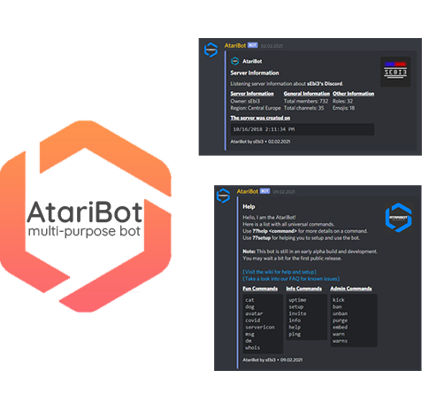

 <!-- PROJECT LOGO -->
<br />
<p align="center">
  <a href="https://github.com/MarkusKgit/MonkeyBot/">
    
  </a>
<h3 align="center">AtariBot for Discord (Build 1.0.44)</h3>
  <p align="center">AtariBot is a multi-purpose bot with many features for moderation, fun and administration.
    <br />
    <br />
    <a href="https://discord.gg/4pnAXKC">Join our Discord</a>
    ·
    <a href="https://meta-modifications.de/docs/AtariBot/fun-commands">List of all Commands</a>
    ·
    <a href="https://meta-modifications.de">Website</a>
  </p>
</p><br><br>
 
 
<!-- TABLE OF CONTENTS -->
## Table of Contents

* [Getting Started](#getting-started)
  * [Set up your own bot application](#set-up-your-own-bot-application)
  * [Installation](#installation)
  * [Change or add permissions to commands](#change-or-add-permissions-to-commands)
* [Contributing](#contributing)
* [Support Me](#support-me)
* [Terms / License](#terms)
 

## This bot was built with:
* <a href="https://dotnet.microsoft.com/en-us/download/dotnet/6.0">.NET 6.0</a>
* <a href="https://dsharpplus.github.io/">DSharpPlus v4.0.1</a>
* <a href="https://dsharpplus.github.io/">DSharpPlus.CommandsNext v4.0.1</a>
* <a href="https://dsharpplus.github.io/">DSharpPlus.Interactivity v4.0.1</a><br><br>


## Current Features
* Every command has a description for the <code>function</code>, <code>arguments</code>, <code>permissions</code>, <code>aliases</code> and on how to use the commands.
* Permissions are set for each command.<br>
  * In this case normal users can't execute commands used by moderators or administartors.<br><br>
* A lot of embeds were used for the commands in order to make it looks more clean and easier to read.
* This bot adds many commands for moderation, administration, information and fun.<br>
  * Take a look at the <code>DSharpPlus Documentation</code> in order to create your own commands.<br>
  * You can also add commands for youself easily by taking a look at the default commands in order to see how they were made.<br><br>


## Getting Started

### Set up your own bot application
 1. Download the source code of the bot <a href="https://github.com/sEbi3/AtariBot">[here]</a>.<br>
 2. Visit the <a href="https://discord.com/developers/applications">Discord Developer Portal</a> and go to <code>Applications</code>.<br>
 3. Create a new Application and open it.
 4. Go to the <code>Bot</code> tab on the left side and <code>add a new Bot</code>.<br>
 5. Copy the <code>Token</code> and paste it into the <code>program.cs</code> class here:

```cs 
discord = new DiscordClient(new DiscordConfiguration
            {
                Token = "Paste your Token here",
                TokenType = TokenType.Bot, MinimumLogLevel = Microsoft.Extensions.Logging.LogLevel.Debug,
            }); 
```

 6. Go back to the <a href="https://discord.com/developers/applications">Discord Developer Portal</a> and go into the <code>General Information</code> tab.
 7. Now copy the <code>Application ID</code> and open <a href="https://discord.com/oauth2/authorize?client_id=711550600286044201&scope=bot&permissions=8">[this URL] </a> on a new tab and change the <code>Application ID</code> from <code>711550600286044201</code> to the one you copied.
 8. Refresh the page and choose your discord server in the dropdown list. The bot will now join your server.<br><br><br><br>
 
### Installation
 1. Create a new <code>Console App (.NET)</code> project.<br>
 2. Add the source code into your project by dragging and dropping all files and folders into your project directory.<br>
 3. Add the <a href="https://dsharpplus.github.io/">DSharpPlus</a> API to your project. (Use the <code>NuGet Manager</code> for adding the API.)<br>
 4. Change everything to your liking. (Have a look above on how to create a <code>bot application</code>)<br><br>
 5. Now you only need to <code>compile the program</code>. In order to start your bot, go into your project files and start the <code>AtariBot.exe</code>.<br>

 The bot is only online when the <code>AtariBot.exe</code> is running. If you want to have the bot online 24/7, you need to rent a server and start the <code>AtariBot.exe</code> from the server. (For uploading the files, you need to use a program that supports FTP.)<br><br><br><br>


### Change or add permissions to commands
 1. Go into one of the Modules. (In this case I use the <code>MiscModule</code>.).
 2. Now find the command where you want to change the permissions. (In this case I use the <code>msg</code> command.).
 3. After you have found the command, find the following <code>if statement</code>:

```cs
if (!ctx.Member.PermissionsIn(ctx.Channel).HasPermission(Permissions.BanMembers)) {
//If the user has not enough permissions, this block of code runs.
}
else {
//If the user has enough permissions, this block of code runs.
}
```

 4. The only thing you need to change are the permissions in the statement. (For example: from <code>Permissions.BanMembers</code> to <code>Permissions.Administrator</code>.)<br>
 5. If you don't want any permissions to be required in order to use a command, just leave the <code>if statement</code> away.<br><br>


<!-- CONTRIBUTING -->
## Contributing

Contributions are what make the open source community such an amazing place to be learn, inspire, and create. Any contributions you make are **greatly appreciated**. 

1. Fork the Project
2. Create your Feature Branch (`git checkout -b feature/AmazingFeature`)
3. Commit your Changes (`git commit -m 'Add some AmazingFeature'`)
4. Push to the Branch (`git push origin feature/AmazingFeature`)
5. Open a Pull Request<br><br>


## Support Me
If you like my work and want access to early versions, please consider supporting me on [**Patreon**](https://www.patreon.com/sEbi3). 


## Terms
You can use and edit this code to your liking. Don't ever claim it to be your own code and provide credit if you are using this code for your project. You are not allowed to reupload the exact same code. This means you are now allowed to copy the classes for changing text for translations or dialogs.

Using the code means parts of the source code in order to implement them for your own projects. You are not allowed to reupload the exact same classes without any big changes except for using the code for personal perposes only.

You can find the full license here: https://sebi3.de/EULA
